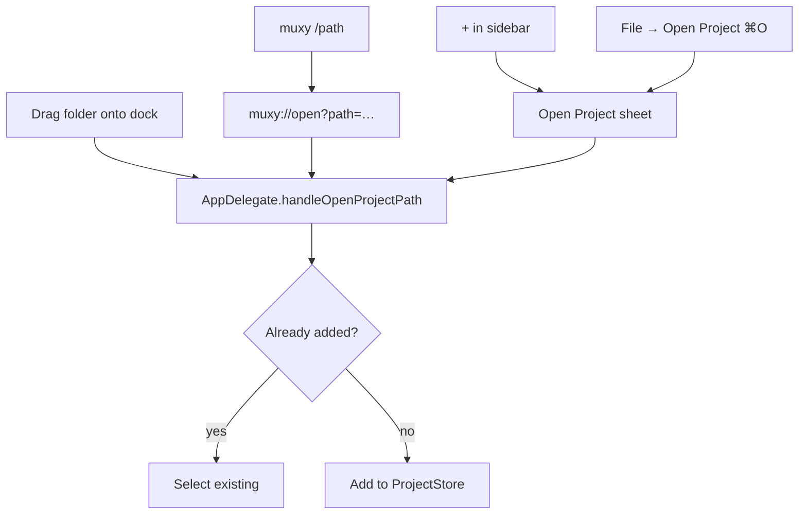

# Projects

A project is a directory plus display metadata: name, logo, icon, color, and sidebar order. Worktrees and workspace snapshots are stored separately so each worktree can restore its own tabs and split tree.

## Adding a project

| Entry point | How |
| --- | --- |
| Sidebar | Click **+** at the bottom |
| Menu | **File → Open Project…** (`⌘O`) |
| Dock | Drag a folder onto the Muxy icon |
| Shell | `muxy /path/to/project` (after **Muxy → Install CLI**) |
| URL | `muxy://open?path=/path/to/project` |

All entry points dedupe — opening the same path twice activates the existing project.

### Finding a folder with Cmd+O

The Muxy picker starts as a folder-name search. Type any part of a folder name, use the arrow keys to choose between matching paths, then press Return to add or open it. Add parent folder names to narrow common results: `capty/app`, `capty app`, and `app capty` all match the `app` folder inside `capty`. Results are searched recursively inside the **Folder search location** configured under **Settings -> Projects**.

Hidden folders, packages, and generated dependency/build trees are not traversed by the name index. To browse any location directly, type an explicit path beginning with `~/`, `/`, `./`, or `../`, such as `~/Projects/` or `/Volumes/Work/`. Path mode keeps folder autocomplete with Tab, parent navigation with Option-Delete, and typed-path confirmation with Cmd+Return. SSH workspaces continue to use path mode so Muxy does not recursively scan remote servers.

## Customising appearance

Right‑click a project in the sidebar:

- **Set Logo...** — use a cropped image as the project icon.
- **Set Icon Color...** — choose the fallback letter badge color.
- **Rename Project** — display name only; doesn't move the folder.
- **Remove** — removes from Muxy; folder on disk is left alone.

## Switching projects

| Action | Shortcut |
| --- | --- |
| Next / Previous | `⌃]` / `⌃[` |
| Project 1–9 | `⌃1…9` |
| Pick from sidebar | Click |

Each project keeps its own active worktree and restores each worktree's tabs, splits, and active tab from workspace snapshots.

## Project workspaces

Use the workspace menu at the top of the sidebar to filter projects into named groups. See [Project Workspaces](project-workspaces.md).

## Open in IDE

Muxy auto‑discovers IDE‑like apps installed on your Mac (VS Code, Zed, Sublime, JetBrains IDEs, Cursor, …). The **Open in IDE** topbar button and **File → Open in IDE** menu show what was found and remember your last choice. The IDE opens at the active worktree's root.

## Persistence

Projects live at `~/Library/Application Support/Muxy/projects.json`. Worktree records live under `~/Library/Application Support/Muxy/worktrees/`, and workspace snapshots live in `~/Library/Application Support/Muxy/workspaces.json`.

## Settings

- **Projects -> Keep projects open** — keeps an empty project in the sidebar.
- **Interface -> Auto-expand Worktrees** — opens the worktree list when you switch projects.
