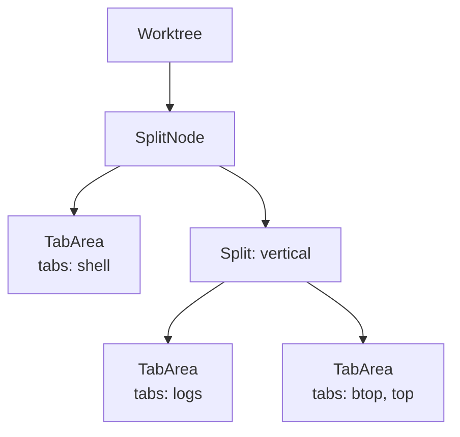

# Tabs & Splits

Every Muxy worktree owns a tree of split panes; each leaf pane holds a stack of tabs.

Splits nest arbitrarily — the layout is a binary tree of horizontal and vertical splits.

## Tab kinds

| Kind | What it is |
| --- | --- |
| Terminal | A libghostty-powered terminal (the default) |
| Browser | A built-in browser tab |
| Extension | A tab rendered by an installed extension |

## Creating tabs

| How | Result |
| --- | --- |
| `⌘T` | New terminal tab |
| File menu → New Tab | New tab in the active pane |

## Renaming, pinning, coloring

- **Rename Tab** — double-click the tab title (or bind a shortcut in Settings → Keyboard Shortcuts; unbound by default).
- **Pin / Unpin** — right-click the tab → **Pin** (or bind a shortcut; unbound by default). Pinned tabs stay leftmost.
- Right-click → **Color** to apply an accent.
- Right-click → **Close Others / Close to the Left / Close to the Right**.

Custom titles and colors are saved in the workspace snapshot and survive worktree switches.

## Splits

| Action | Shortcut |
| --- | --- |
| Split Right | `⌘D` |
| Split Down | `⌘⇧D` |
| Close Pane | `⌘⇧W` |
| Focus Pane | `⌘⌥←/→/↑/↓` |
| Toggle Maximize Pane | `⌘⌥↩` |
| Cycle Tab (All Panes) | `⌃Tab` / `⌃⇧Tab` |

## Maximize pane

Use the maximize button in a pane's tab strip, or press `⌘⌥↩`, to temporarily focus that pane in a split workspace. Press the same shortcut or the restore button to show the full split tree again.

Maximize is available only when the worktree has multiple panes. Moving focus to another pane or splitting the maximized pane restores the full layout.

## Drag and drop

Tabs can be dragged within a pane to reorder, between panes to move, or onto a pane edge to create a new split.

## Tab Focused layout

Choose **Tab Focused** under **Settings → Interface** to move tab navigation into the left sidebar. The sidebar groups open tabs by project, keeps every project visible when it has no open tabs, preserves project switching on `⌃1…9`, and shows tab shortcuts for the first nine open tabs.

## Navigation history

Mouse side buttons (3 / 4) and three-finger horizontal trackpad swipes navigate Back / Forward through tab history. Keyboard equivalents: `⌘⌃←` / `⌘⌃→`.

## Persistence

The tab and split tree per worktree is saved automatically in `~/Library/Application Support/Muxy/workspaces.json`. Muxy restores tabs, split structure, titles, colors, pins, and working directories when it can recreate the workspace.

Use [Layouts](../layouts/overview.md) for reusable presets you want to keep in a repo and apply on demand.
